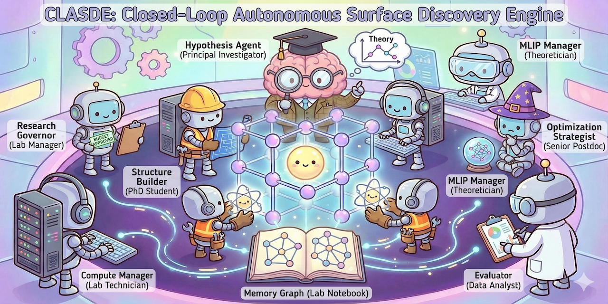
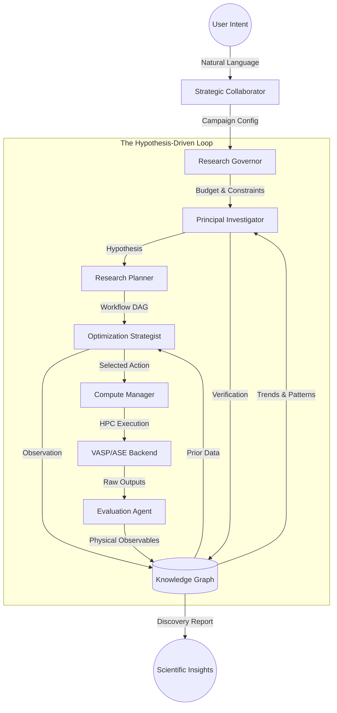

# CLASDE: Closed-Loop Autonomous Surface Discovery Engine

<p align="center">
  
</p>

CLASDE is a multi-agent framework designed to automate the discovery of stable and high-performing surface configurations in complex functional materials. The engine mimics the hierarchy of a computational research group, integrating Large Language Models (LLMs) for conceptualization with high-performance computing (HPC) for physical execution.

---

## Repository Architecture

The system is organized into distinct layers to separate scientific reasoning from computational execution.

### The Lab Metaphor: Roles and Responsibilities

To understand how CLASDE operates, each agent is mapped to a specific role within a traditional computational surface science research group.

| Role | Metaphor | Responsibility |
| :--- | :--- | :--- |
| **Strategic Collaborator** | **The Investor/Expert** | Translates natural language intent into formal scientific campaigns via LLMs. |
| **Principal Investigator** | **The PI Agent** | The logic lead. Formulates testable hypotheses from literature and verifies them against empirical data. |
| **Research Planner** | **The Research Scientist** | Translates hypotheses into executable Directed Acyclic Graphs (DAGs), ensuring logical task sequencing. |
| **Research Governor** | **The Lab Manager** | Enforces objectives, hard budget safety ceilings, and chemical constraints (e.g. charge neutrality). |
| **Optimization Strategist** | **The Senior Postdoc** | Executes Bayesian Optimization using surrogate models (Gaussian Processes) to select the next experiment. |
| **Structure Builder** | **The PhD Student** | Constructs 3D atomic slabs, enforcing symmetry-aware distortions (orthorhombic/tetragonal) and stoichiometric constraints. |
| **Compute Manager** | **The Lab Technician** | Orchestrates HPC execution (VASP, MLIP) with autonomous re-attachment, recovery, and backend abstraction. |
| **Evaluation Agent** | **The Data Analyst** | Parses raw outputs and anchors calculated rewards to NIST-benchmarked thermochemical data. |
| **Knowledge Graph** | **The Lab Notebook** | A digital archive recording the full scientific provenance of states, transitions, and empirical results. |

---

## How CLASDE Works: The Discovery Loop

CLASDE operates through a self-correcting feedback loop where specialized agents interact via a shared Scientific Knowledge Graph. This loop elevates the system from simple optimization to autonomous scientific discovery.



### Implementation Logic
1. **Literature Ingestion**: The engine identifies relevant scientific claims from the local Literature Database.
2. **Hypothesis Formulation**: The PI Agent synthesizes these claims into a formal Scientific Hypothesis (e.g. predicting a specific stability trend).
3. **DAG Planning**: The Research Planner generates a Task Node graph (Build -> Relax -> Analyze) optimized to test the PI's theory.
4. **Autonomous Execution**: The Compute Manager dispatches tasks to backends (VASP or local MLIP) based on the required fidelity.
5. **Verification**: The Evaluation Agent parses results, and the PI compares them against the original hypothesis to verify or falsify the theory.
6. **Theory Evolution**: The loop restarts with a refined hypothesis, ensuring cumulative scientific learning.

---

## Installation and Environment Setup

### 1. Python Environment
The engine requires Python 3.9 or higher. It is recommended to use a virtual environment or Conda.

```bash
# Development Installation
git clone <repository-url>
cd clasde_bill
pip install -e .
```

### 2. Dependency Management
Core dependencies are managed via `pyproject.toml`. Key packages include:
- **Pymatgen**: Primary library for structural analysis and symmetry detection.
- **ASE (Atomic Simulation Environment)**: Interface for interatomic potentials and calculator management.
- **CHGNet/MatGL**: Machine-learned interatomic potentials for rapid screening.
- **Scikit-Learn**: Provides the Gaussian Process and Random Forest surrogates for the Strategist.

---

## Configuration Guide

### 1. API Credentials (.env)
The Collaborator Agent requires a Google Gemini API key for natural language translation and reasoning. Create a `.env` file in the root directory:

```text
GOOGLE_API_KEY=your_api_key_here
CLASDE_MOCK_LLM=false
```

### 2. Compute Profile (compute_profile.yaml)
This file defines the interface between the engine and your specific computing environment. It must be present in the root or a configured path.

```yaml
platform: "hpc" # Options: hpc, local
executable: "/path/to/vasp_std"
run_command: "mpirun -np {ntasks} {executable}"

# Slurm Header Configuration
slurm:
  partition: "xeon-p8"
  extra_header: |
    #SBATCH --time=24:00:00
    module load intel-oneapi/2023.1
    source /etc/profile

# Default VASP Parameters
vasp_params:
  PREC: "Accurate"
  ENCUT: 450
  LORBIT: 11
```

### 3. Reference Data (reference_data.yaml)
Adsorption energies are calculated relative to gas-phase species. This file contains standard NIST-anchored baselines used if computed references are not yet available in the local database.

---

## Operational Commands

### Natural Language Research
Use the Collaborator CLI to start a campaign from a research question.
```bash
clasde-collaborator --prompt "How does sulfur poisoning affect the oxygen reduction reaction on LSCF?"
```

### Long-Running Persistence (Watchdog)
For campaigns executed on clusters with potential login node timeouts, use the standalone watchdog to maintain campaign health and handle Slurm re-attachment.
```bash
python3 autonomous_watchdog.py --configs configs/test_lscf_poisoning.yaml
```

### Direct Execution
Launch a pre-configured YAML campaign directly.
```bash
clasde-loop --config configs/your_campaign.yaml
```
