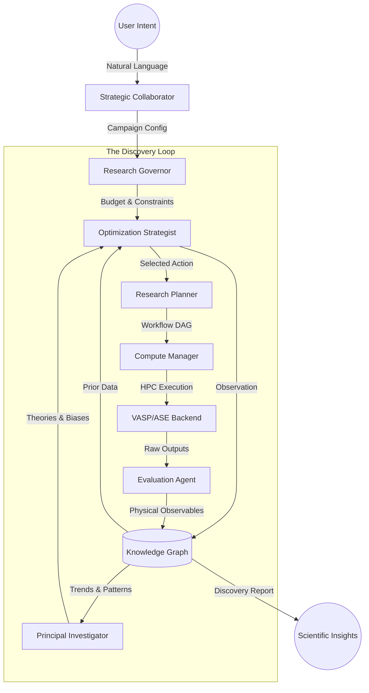

# CLASDE: Closed-Loop Autonomous Surface Discovery Engine

<p align="center">
  
</p>

CLASDE is a multi-agent, autonomous optimization framework designed for the discovery of stable and high-performing surface configurations in complex functional materials and electrocatalysts.

The system is designed to mimic the roles of a world-class computational research group, automating the entire cycle from natural language conceptualization to high-fidelity HPC execution and physical law induction.

---

## Repository Structure

The framework separates physical ground truths, optimization mathematics, execution agents, and autonomous reasoning.

```text
CLASDE/
├── agents/             # DECISION MAKERS (The "Who")
│   ├── collaborator_agent.py # Human-Machine Interface (LLM)
│   ├── hypothesis_agent.py   # Scientific Theory Induction (PI)
│   ├── planner_agent.py      # Dynamic Workflow Formulation
│   ├── governor_agent.py     # Budget & Constraint Enforcement (Lab Manager)
│   ├── strategist_agent.py   # Experiment Selection (BO / Senior Postdoc)
│   ├── builder_agent.py      # Generalized Perovskite Construction
│   └── evaluator_agent.py    # Result Interpretation (Data Analyst)
│
├── science/            # DOMAIN OBJECTS (The "What")
│   ├── workflow_graph.py     # DAG execution engine (WorkflowExecutor)
│   ├── chemistry.py          # Data-driven cation site heuristics
│   ├── validator.py          # Physical constraint enforcement
│   ├── descriptors.py        # Band-center and GCN calculations
│   └── theory_builder.py     # Physical law discovery
│
├── memory/             # CENTRALIZED KNOWLEDGE
│   ├── knowledge_graph.py    # Semantic scientific provenance
│   └── experiment_db.py      # SQLite-backed experiment repository
│
├── execution/          # INFRASTRUCTURE (The "Action")
│   ├── compute_agent.py      # Backend abstraction (VASP, ASE, MLIP)
│   └── workflow_executor.py  # Orchestration of task dependencies
│
├── core/               # SCIENTIFIC PRIMITIVES
│   ├── state.py              # SurfaceState representation
│   ├── action.py             # Mutation operators
│   └── transition.py         # Physics rules
│
├── configs/            # CONFIGURATION & DATA
│   ├── default.yaml          # System-wide defaults
│   └── reference_data.yaml   # NIST-anchored thermochemical references
└── autonomous_watchdog.py # Persistence & recovery manager
```

---

## The Lab Metaphor: Roles & Responsibilities

To understand how CLASDE operates, imagine a high-performance computational chemistry research group. Each software component maps to a specific role in the lab.

| Role | METAPHOR | Responsibility |
| :--- | :--- | :--- |
| **Strategic Collaborator** | **The Investor/Expert** | Translates natural language intent into formal scientific campaigns via LLMs. |
| **Principal Investigator** | **The PI Agent** | Induces physical laws (e.g., d-band center correlations, scaling relations) from the Knowledge Graph. |
| **Research Planner** | **The Research Scientist** | Dynamically constructs task sequences based on a Directed Acyclic Graph (DAG) of scientific necessity. |
| **Research Governor** | **The Lab Manager** | Enforces objectives, hard budget safety ceilings, and chemical constraints (e.g. charge neutrality). |
| **Optimization Strategist** | **The Senior Postdoc** | Operates the Surrogate Model and selects the optimal next experiment via Bayesian Acquisition Functions. |
| **Structure Builder** | **The PhD Student** | Builds 3D atomic structures, enforcing symmetry-aware distortions (Orthorhombic/Tetragonal) and charge compensation. |
| **Compute Manager** | **The Lab Technician** | Orchestrates HPC execution (VASP, MLIP) with autonomous re-attachment, recovery, and backend abstraction. |
| **Evaluation Agent** | **The Data Analyst** | Parses raw DFT outputs and anchors rewards to NIST Gas-Phase Reference Data. |
| **Knowledge Graph** | **The Lab Notebook** | A digital archive recording the full scientific provenance of states, transitions, and empirical results. |

---

## How CLASDE Works: The Discovery Loop

CLASDE operates through a self-correcting feedback loop where specialized agents interact via a shared Scientific Knowledge Graph. This loop elevates the system from simple "search" to "autonomous discovery."



### 1. Conceptualization (Natural Language to Formal Goal)
The discovery starts when a user provides a research question. The Collaborator Agent translates this intent into a formal Campaign. For example:
- **Question:** "How does oxygen adsorption change across all facets of LSF?" -> **MAPPING Mode** (Builds a global electronic property map).
- **Question:** "Which dopant minimizes the oxygen vacancy formation energy on LSF?" -> **TUNING Mode** (Finds the optimal chemistry).

### 2. Strategic Observation (Memory to Belief)
The Optimization Strategist observes all prior experiments stored in the Knowledge Graph. It updates its internal Belief State—a probabilistic surrogate model (Gaussian Process)—that maps structural descriptors to physical performance.

### 3. Hypothesis Generation (PI Reasoning)
Simultaneously, the Principal Investigator (PI) agent analyzes the graph for emergent trends. It calculates statistical support for physical laws. These induced theories are used to bias the search toward scientifically interesting regions.

### 4. Dynamic Planning (Workflow DAGs)
Unlike static pipelines, the Research Planner generates a formal Directed Acyclic Graph (DAG) of tasks for each candidate. The WorkflowExecutor ensures that dependencies (e.g., `Build` -> `Relax` -> `Analyze`) are met and data is passed correctly between tasks.

### 5. Physical Execution (HPC Orchestration)
The Compute Manager translates these plans into HPC job scripts. It handles the "How" of running calculations, whether on VASP (HPC) or ASE (Local), and autonomously recovers from common DFT failures (e.g. electronic divergence).

### 6. Knowledge Integration (The Digital Lab Notebook)
Finally, the Evaluation Agent parses the raw outputs and anchors them to NIST thermochemistry. Results are integrated back into the Knowledge Graph, completing the cycle and informing the PI's next round of theories.

---

## Usage

### Natural Language Collaboration
Initiate a project by describing your goal in plain English.
```bash
clasde-collaborator --prompt "I want to optimize the ORR activity on SrTiO3 by doping the B-site with transition metals."
```

### Direct Campaign Execution
```bash
clasde-loop --config configs/your_campaign.yaml
```

### Domain-Specific Surface Exploration
```bash
# Syntax: clasde-explore <Material> <Facet> <Adsorbate>
clasde-explore LaSrFeO3 001 O
```

---

## Installation & Configuration

1. **Install dependencies:**
   ```bash
   pip install .
   ```

2. **Configure API Access:**
   Copy `.env_example` to `.env` and add your Google Gemini API key.

3. **Compute Profile:**
   Configure `compute_profile.yaml` with your Slurm partition and VASP executable paths. Standard NIST references are provided in `configs/reference_data.yaml`.
