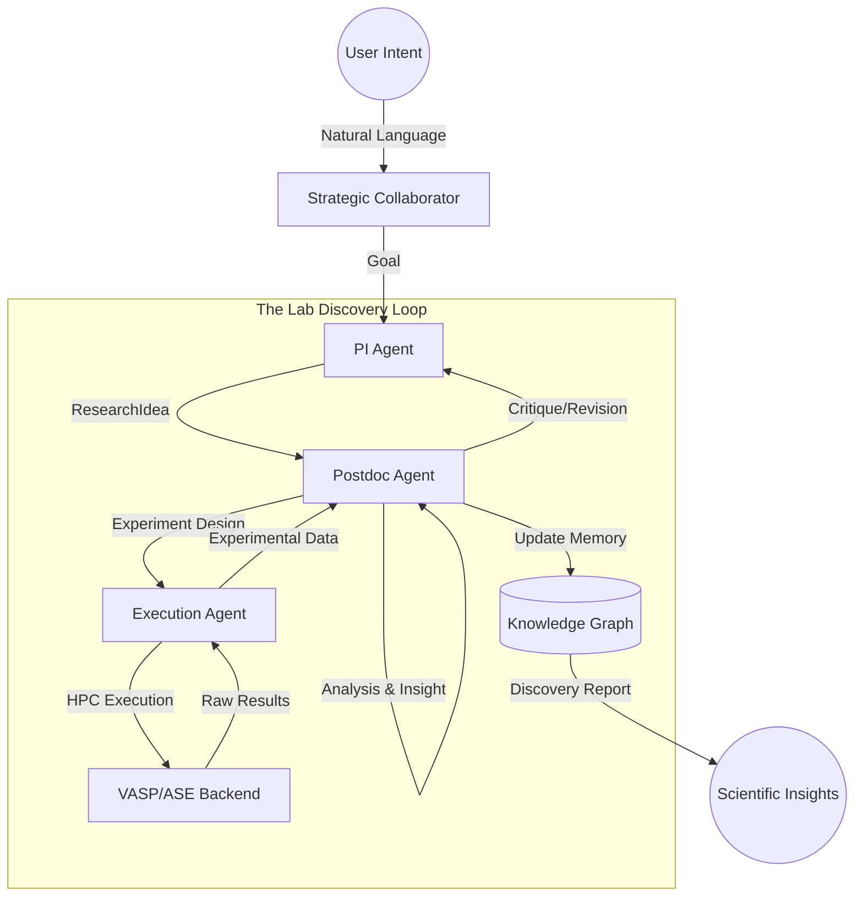

# CLASDE: Closed-Loop Autonomous Surface Discovery Engine

<p align="center">
  
</p>

CLASDE is a multi-agent framework designed to automate the discovery of stable and high-performing surface configurations in complex functional materials. The engine mimics the hierarchy of a computational research group, integrating Large Language Models (LLMs) for conceptualization with high-performance computing (HPC) for physical execution.

---

## Repository Architecture

The system is organized into distinct layers to separate scientific reasoning from computational execution.

```text
CLASDE/
├── agents/             # DECISION MAKERS (The "Who")
│   ├── collaborator_agent.py # Human-Machine Interface (LLM)
│   ├── pi_agent.py           # Strategic Vision (PI Agent)
│   ├── postdoc_agent.py      # Knowledge Transformer (Postdoc Agent)
│   ├── execution_agent.py    # Experimentalist (Technician Agent)
│   ├── governor_agent.py     # Budget & Constraint Enforcement (Lab Manager)
│   ├── builder_agent.py      # Symmetry-aware structural construction
│   └── evaluator_agent.py    # Result Interpretation (Data Analyst)
│
├── core/               # SCIENTIFIC PRIMITIVES
│   ├── campaign_manager.py   # Central Loop Orchestrator
│   ├── lab_objects.py        # Formal Knowledge Layers (Idea, Hypothesis, Exp)
│   ├── state.py              # SurfaceState (Source of Truth)
│   ├── action.py             # Mutation operators
│   ├── transition.py         # Physics rules
│   └── workflow_graph.py     # DAG Engine & WorkflowExecutor
│
├── science/            # DOMAIN OBJECTS (The "What")
│   ├── chemistry.py          # Data-driven cation site heuristics
│   ├── validator.py          # Physical constraint enforcement
│   ├── descriptors.py        # Band-center and GCN calculations
│   ├── theory_builder.py     # Physical law discovery
│   ├── adsorption_site_finder.py # Symmetry-unique site detection
│   └── reaction_network.py   # Microkinetic modelling structures
│
├── memory/             # CENTRALIZED KNOWLEDGE
│   ├── knowledge_graph.py    # Semantic scientific provenance
│   ├── experiment_db.py      # SQLite-backed experiment repository
│   ├── hypothesis_db.py      # Database of PI theories
│   ├── literature_db.py      # Prior knowledge storage
│   └── storage_provider.py   # Backend-agnostic Storage Registry
│
├── execution/          # INFRASTRUCTURE (The "Action")
│   ├── compute_agent.py      # Backend abstraction (VASP, ASE, MLIP)
│   └── auth_provider.py      # Modular credential management
│
├── workflows/          # ORCHESTRATION (The "Process")
│   ├── neb_workflow.py        # Transition state sequences
│   └── templates/             # Reusable task sequences
│
├── configs/            # CONFIGURATION & DATA
└── autonomous_watchdog.py # Persistence & recovery manager
```

### The Lab Metaphor: Roles and Responsibilities

| Role | Metaphor | Responsibility |
| :--- | :--- | :--- |
| **Principal Investigator** | **The PI Agent** | Formulates high-level **ResearchIdeas** and intuition. Provides the "What" and "Why". |
| **Senior Postdoc** | **The Postdoc Agent** | The intellectual bridge. Critiques PI ideas, formalizes testable **Hypotheses**, designs **Experiments**, and interprets **Insights**. |
| **Lab Technician** | **The Execution Agent** | Strictly executes Level 3 **Experiments**. Manages the interface with HPC resources (VASP, MLIP). |
| **Strategic Collaborator** | **The Expert Consultant** | Translates natural language intent into structured research goals for the PI. |
| **Research Governor** | **The Lab Manager** | Enforces objectives, hard budget safety ceilings, and chemical constraints (e.g. charge neutrality). |
| **Structure Builder** | **The PhD Student** | Builds 3D atomic structures, enforcing symmetry-aware distortions and stoichiometric constraints. |
| **Evaluation Agent** | **The Data Analyst** | Parses raw outputs and anchors calculated rewards to NIST-benchmarked thermochemical data. |

---

## How CLASDE Works: The Knowledge Transformation Loop

CLASDE operates through a self-correcting hierarchical feedback loop. Unlike simple optimization, it enforces a "scientific compiler" approach where ideas must be formalised into testable objects before execution.



### Transformation Rules
1. **Rule 1: Hierarchical Flow**: PI cannot talk to execution directly. Knowledge must be transformed by the Postdoc.
2. **Rule 2: Postdoc Critique**: Every **ResearchIdea** from the PI is critiqued for combinatorial sanity and physical validity before formalization.
3. **Rule 3: Testable Hypothesis**: Postdoc converts ideas into a **Hypothesis** with a controllable variable and a measurable metric (e.g., E_ads).
4. **Rule 4: Design to Execution**: The Postdoc designs a batch of **Experiments** (Level 3 objects) which are handed to the Technician for execution.
5. **Rule 5: Insight Extraction**: After execution, the Postdoc interprets the raw data into an **Insight**, updating the lab's collective memory.

---

## Installation and Environment Setup

### 1. Python Environment
The engine requires Python 3.9 or higher. It is recommended to use a virtual environment or Conda.

```bash
# Development Installation
git clone <repository-url>
cd clasde_bill
pip install -e .
```

### 2. Dependency Management
Core dependencies are managed via `pyproject.toml`. Key packages include:
- **Pymatgen**: Primary library for structural analysis and symmetry detection.
- **ASE (Atomic Simulation Environment)**: Interface for interatomic potentials and calculator management.
- **CHGNet**: Machine-learned interatomic potential for rapid screening.
- **Scikit-Learn**: Provides the Gaussian Process surrogates for the Strategist.

---

## Configuration Guide

### 1. API Credentials (.env)
The system requires a Google Gemini API key for natural language reasoning and optional HPC credentials for cluster execution. Create a `.env` file in the root directory:

```text
GOOGLE_API_KEY=your_api_key_here
CLASDE_MOCK_LLM=false

# Optional HPC Credentials
HPC_USER=your_username
HPC_HOST=your_cluster_host
HPC_KEY_PATH=/path/to/your/ssh/key
```

### 2. Compute Profile (compute_profile.yaml)
This file defines the interface between the engine and your specific computing environment. It must be present in the root or a configured path.

```yaml
platform: "hpc" # Options: hpc, local
executable: "/path/to/vasp_std"
run_command: "mpirun -np {ntasks} {executable}"

# Slurm Header Configuration
slurm:
  partition: "xeon-p8"
  extra_header: |
    #SBATCH --time=24:00:00
    module load intel-oneapi/2023.1
    source /etc/profile

# Default VASP Parameters
vasp_params:
  PREC: "Accurate"
  ENCUT: 450
  LORBIT: 11
```

### 3. Reference Data (reference_data.yaml)
Adsorption energies are calculated relative to gas-phase species. This file contains standard NIST-anchored baselines used if computed references are not yet available in the local database.

---

## Operational Commands

### Natural Language Research
Use the Collaborator CLI to start a campaign from a research question.
```bash
clasde-collaborator --prompt "How does sulfur poisoning affect the oxygen reduction reaction on LSCF?"
```

### Long-Running Persistence (Watchdog)
For campaigns executed on clusters with potential login node timeouts, use the standalone watchdog to maintain campaign health and handle Slurm re-attachment.
```bash
python3 autonomous_watchdog.py --configs configs/test_lscf_poisoning.yaml
```

### Direct Execution
Launch a pre-configured YAML campaign directly.
```bash
clasde-loop --config configs/your_campaign.yaml
```
