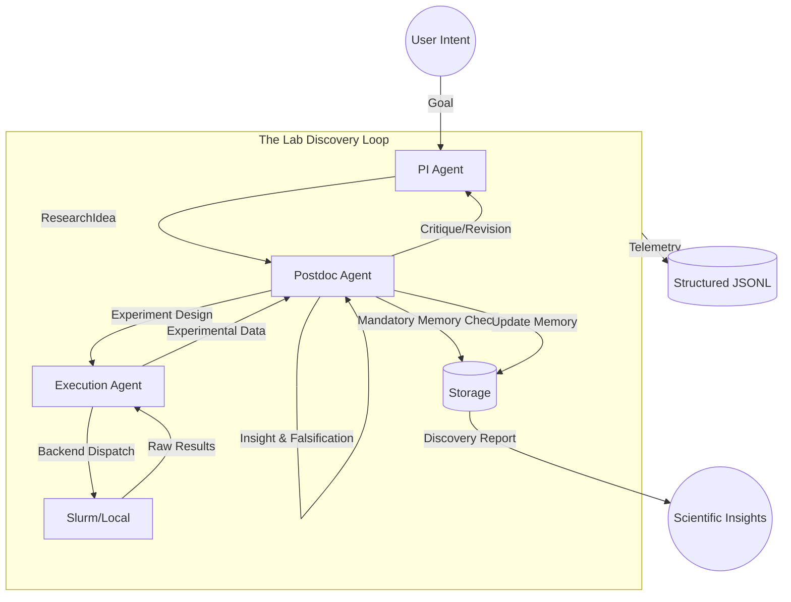

# CLASDE: Closed-Loop Autonomous Surface Discovery Engine

<p align="center">
  
</p>

CLASDE is a multi-agent framework designed to automate the discovery of stable and high-performing surface configurations in complex functional materials. The engine mimics the hierarchy of a computational research group, integrating Large Language Models (LLMs) for conceptualization with high-performance computing (HPC) for physical execution.

---

## Repository Architecture

The system is organized into distinct layers to separate scientific reasoning from computational execution.

```text
CLASDE/
├── agents/             # DECISION MAKERS (The "Who")
│   ├── pi_agent.py           # Strategic Vision (PI Agent)
│   ├── postdoc_agent.py      # Knowledge Transformer (Postdoc Agent)
│   └── execution_agent.py    # Experimentalist (Technician Agent)
│
├── core/               # SCIENTIFIC PRIMITIVES
│   ├── campaign_manager.py   # Central Loop Orchestrator
│   ├── lab_objects.py        # Formal Knowledge Layers (Idea, Hypothesis, Exp)
│   ├── telemetry.py          # System Observability & Metrics
│   └── schemas.py            # Data Contracts & Type Safety
│
├── science/            # DOMAIN OBJECTS (The "What")
│   ├── objective_functions.py # Synthetic Lab (Validation Layer)
│   ├── chemistry.py          # Data-driven cation site heuristics
│   └── theory_builder.py     # Physical law discovery
│
├── execution/          # INFRASTRUCTURE (The "Action")
│   ├── compute_agent.py      # Backend abstraction (VASP, ASE, MLIP)
│   └── backends/             # Platform-specific drivers (Slurm, Local)
│
├── memory/             # CENTRALIZED KNOWLEDGE
│   ├── experiment_db.py      # SQLite-backed experiment repository
│   └── storage_provider.py   # Mandatory Retrieval API
```

### The Lab Metaphor: Roles and Responsibilities

| Role | Metaphor | Responsibility |
| :--- | :--- | :--- |
| **Principal Investigator** | **The PI Agent** | Formulates high-level **ResearchIdeas**. Provides the "What" and "Why". |
| **Senior Postdoc** | **The Postdoc Agent** | **The Intellectual Gatekeeper.** Critiques PI ideas, performs mandatory memory reasoning, formalizes **Hypotheses**, and designs **Experiments**. |
| **Lab Technician** | **The Execution Agent** | Strictly executes Level 3 **Experiments** via decoupled backends as PhD student. |
| **Telemetry System** | **The Lab Notebook** | Automatically records every decision, job submission, and scientific insight in structured JSONL. |

---

## How CLASDE Works: The Knowledge Transformation Loop

CLASDE operates through a strict hierarchical feedback loop. It enforces a "scientific compiler" approach where ideas must be formalised and critiqued before execution.



### Transformation Rules
1. **Rule 1: Postdoc Authority**: The Postdoc MUST critique the PI's idea. It has the power to reject or revise plans based on physical validity and memory.
2. **Rule 2: Mandatory Memory Reasoning**: Before designing experiments, the Postdoc MUST analyze trends from the `ExperimentDatabase`.
3. **Rule 3: Falsifiable Hypothesis**: Knowledge is passed as strict `Hypothesis` objects containing a variable, manipulation, and a clear `falsification_condition`.
4. **Rule 4: Decoupled Execution**: The `ExecutionAgent` interacts with hardware through an `ExecutionBackend` interface, ensuring portability and reliability.
5. **Rule 5: Knowledge Tracing**: Every step of the transformation (Idea -> Critique -> Hypothesis -> Result) is logged as a `KnowledgeTrace` for full auditability.

---

## Installation and Environment Setup

### 1. Python Environment
The engine requires Python 3.9 or higher. It is recommended to use a virtual environment or Conda.

```bash
# Development Installation
git clone <repository-url>
cd clasde_bill
pip install -e .
```

### 2. Dependency Management
Core dependencies are managed via `pyproject.toml`. Key packages include:
- **Pymatgen**: Primary library for structural analysis and symmetry detection.
- **ASE (Atomic Simulation Environment)**: Interface for interatomic potentials and calculator management.
- **CHGNet**: Machine-learned interatomic potential for rapid screening.
- **Scikit-Learn**: Provides the Gaussian Process surrogates for the Strategist.

---

## Configuration Guide

### 1. API Credentials (.env)
The system requires a Google Gemini API key for natural language reasoning and optional HPC credentials for cluster execution. Create a `.env` file in the root directory:

```text
GOOGLE_API_KEY=your_api_key_here
CLASDE_MOCK_LLM=false

# Optional HPC Credentials
HPC_USER=your_username
HPC_HOST=your_cluster_host
HPC_KEY_PATH=/path/to/your/ssh/key
```

### 2. Compute Profile (compute_profile.yaml)
This file defines the interface between the engine and your specific computing environment. It must be present in the root or a configured path.

```yaml
platform: "hpc" # Options: hpc, local
executable: "/path/to/vasp_std"
run_command: "mpirun -np {ntasks} {executable}"

# Slurm Header Configuration
slurm:
  partition: "xeon-p8"
  extra_header: |
    #SBATCH --time=24:00:00
    module load intel-oneapi/2023.1
    source /etc/profile

# Default VASP Parameters
vasp_params:
  PREC: "Accurate"
  ENCUT: 450
  LORBIT: 11
```

### 3. Reference Data (reference_data.yaml)
Adsorption energies are calculated relative to gas-phase species. This file contains standard NIST-anchored baselines used if computed references are not yet available in the local database.

---

## Operational Commands

### Natural Language Research
Use the Collaborator CLI to start a campaign from a research question.
```bash
clasde-collaborator --prompt "How does sulfur poisoning affect the oxygen reduction reaction on LSCF?"
```

### Long-Running Persistence (Watchdog)
For campaigns executed on clusters with potential login node timeouts, use the standalone watchdog to maintain campaign health and handle Slurm re-attachment.
```bash
python3 autonomous_watchdog.py --configs configs/test_lscf_poisoning.yaml
```

### Direct Execution
Launch a pre-configured YAML campaign directly.
```bash
clasde-loop --config configs/your_campaign.yaml
```
